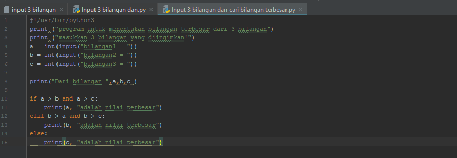
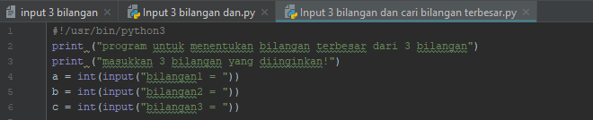
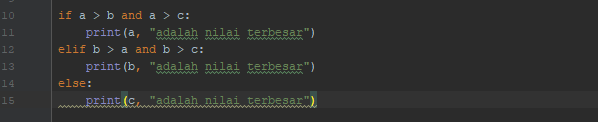
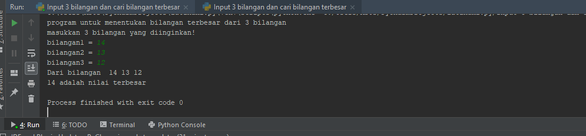
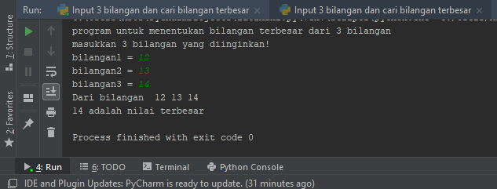

# labspy02 <h1>

# Uraian algoritma
Diketahui 3 buah bilangan bil1,bil2,bil3, akan dicari nilai yang terbesar.

* Mulai
* Inisiasi bil1,bil2,bil3 sebagai integer.
* Baca bil1
* Baca bil2
* Baca bil3
* Jika bil1 > bil2 dan bil1 > bil3 maka cetak bil 1 terbesar
* Jika tidak, bil2 > bil1 dan bil2 > bil3 maka cetak bil 2 terbesar
* Jika tidak, bil3 maka vetak terbesar
* Selesai

# Flowchart menentukan bilangan terbesar dari 3 bilangan
# 

# * Program stelah di buat dari Algoritma di atas
# Hasil program input 3 bilangan mencari bilangan terbesar
# 

# * Penjelasan Program
# * Inisialisasi dan Input
# 

# * Percabangan
# 

# * Hasil eksekusi program input 3 bilangan mencari bilangan terbesar
# 
# 
