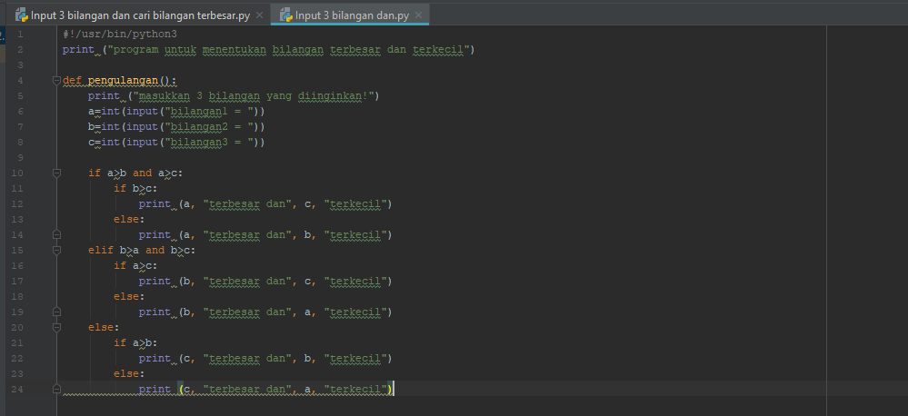

# labspy02 <h1>
Pernyataan if
Pada python dikenal penggunaan struktur kondisi menggunakan statement if, dimana
format/syntax penggunaan statement if adalah:
syntax:
if kondisi:
          statement_true
contoh program input 3 bilangan mencari bilangan terbesar menggunakan statement "if"
#  <h2>

Pernyataan if ... else
syntax:
if kondisi:
          statement_true
else:
    statement_false
contoh program input 3 bilangan mencari bilangan terbesar menggunakan statement if ... else
#  <h2>
Pernyataan if ... elif
syntax:
if kondisi:
          statement_true
elif kondisi2:
          statement_true
else:
          statement_false
Contoh program input 3 bilangan mencari bilangan terbesar menggunakan statement if ... elif
#  <h2>
# Uraian algoritma 
Diketahui 3 buah bilangan bil1,bil2,bil3, akan dicari nilai yang terbesar.

* Mulai
* Inisiasi bil1,bil2,bil3 sebagai integer.
* Baca bil1.
* Baca bil2.
* Baca bil3.
* Jika bil1 > bil2 dan bil1 > bil3 maka kerjakan langkah 8, selain itu
* Jika bil2 > bil1 dan bil2 > bil3 maka kerjakan langkah 9, selain itu kerjakan langkah 10.
* Cetak “Bilangan Terbesar Bilangan Pertama”.
* Cetak “Bilangan Terbesar Bilangan Kedua”.
* Cetak “Bilangan Terbesar Bilangan Ketiga”.
* Selesai

# Flowchart
# 

# Hasil eksekusi program input 3 bilangan mencari bilangan terbesar
# 
# 

# Kondisi Inputan data
# 
# 
# 
